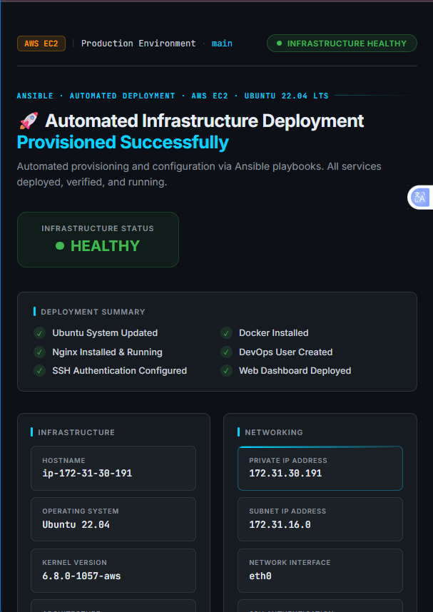
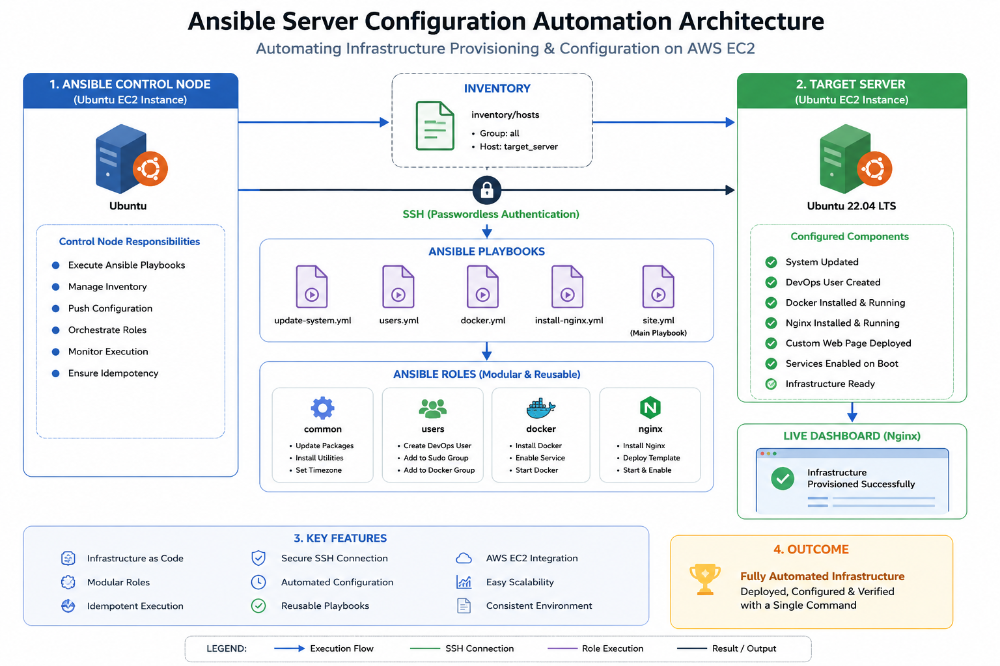
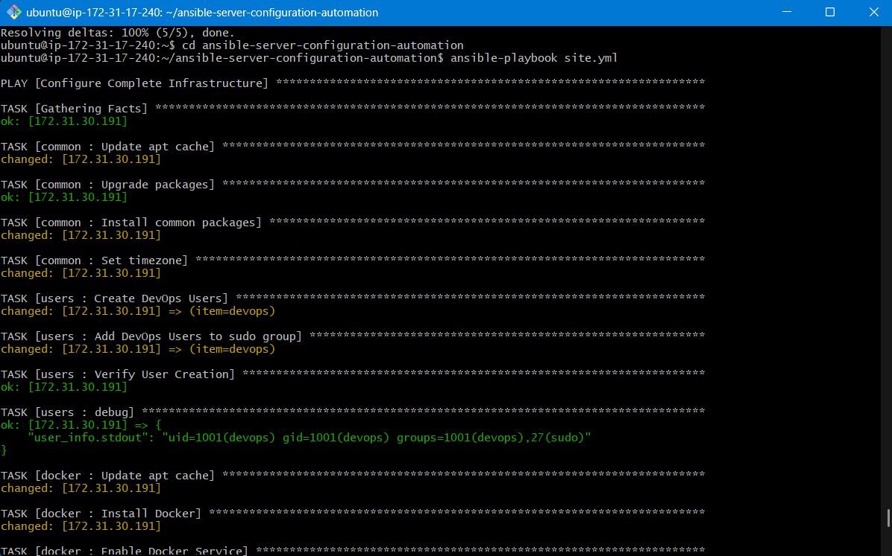
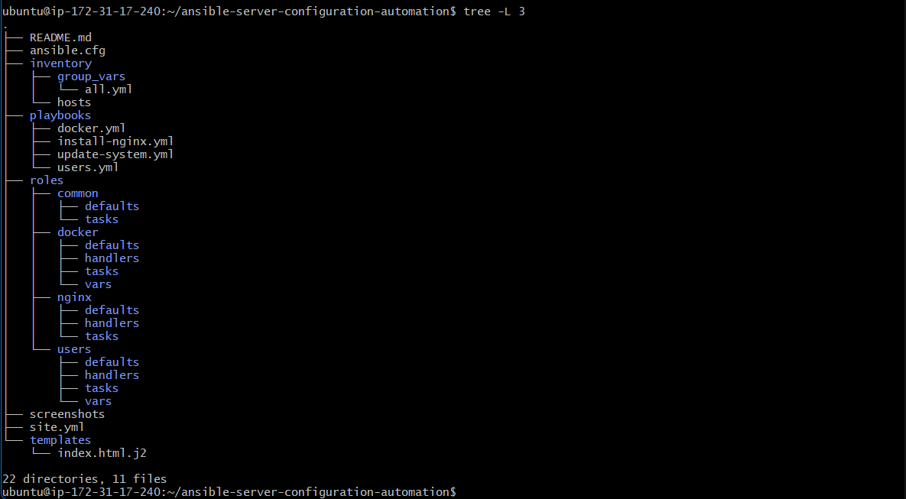
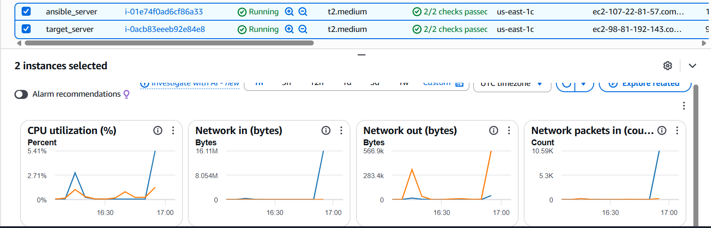
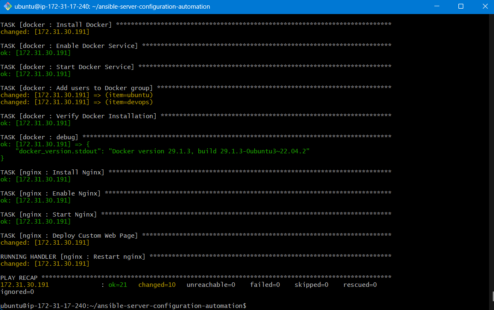

<div align="center">

# 🚀 Ansible Server Configuration Automation


---


---


**Enterprise Infrastructure Automation using Ansible Roles, Playbooks and AWS EC2**

*Automating Linux server provisioning, configuration and service deployment with reusable Infrastructure as Code (IaC).*

</div>

---

<p align="center">
  
</p>

---

## 📑 Table of Contents

- [Project Overview](#-project-overview)
- [Features](#-features)
- [Architecture](#-architecture)
- [Project Statistics](#-project-statistics)
- [Technologies](#-technologies-used)
- [Project Structure](#-project-structure)
- [Installation](#-how-to-run)
- [Verification](#-verification)
- [Screenshots](#-screenshots)
- [Roadmap](#-roadmap)
- [Skills Demonstrated](#-skills-demonstrated)
- [Author](#-connect-with-me)

---

## 📖 Project Overview

Managing Linux servers manually becomes time-consuming and error-prone as infrastructure grows.

This project demonstrates how **Ansible** can automate the complete configuration of AWS EC2 instances using reusable playbooks and modular roles.

The automation provisions and configures an Ubuntu server by installing essential software, creating users, deploying a web server, and verifying services automatically.

The entire infrastructure can be configured using a **single Ansible command**.

---

## 🎯 Project Objectives

- Automate Linux server configuration
- Eliminate repetitive manual administration
- Deploy production-ready infrastructure
- Demonstrate Infrastructure as Code (IaC)
- Apply Ansible best practices using Roles
- Improve consistency and scalability

---

## 🏗 Architecture

```
                    Developer

                        │
                        ▼

               Ansible Control Node
                 (Ubuntu EC2)

                        │
                SSH Authentication

                        │
                        ▼

                Inventory (hosts)

                        │

                  site.yml Playbook

                        │

        ┌───────────────┼────────────────┐

        ▼               ▼                ▼

   Common Role      Docker Role     Users Role

                        │

                        ▼

                  Nginx Role

                        │

                        ▼

             Target Ubuntu EC2 Instance

                        │

         Docker + Nginx + DevOps User

                        │

                        ▼

         Automated Infrastructure Ready
```

---

## 🚀 Features

✅ Passwordless SSH Authentication  
✅ Inventory-based Server Management  
✅ Modular Ansible Roles  
✅ Reusable Playbooks  
✅ Docker Installation  
✅ Nginx Deployment  
✅ DevOps User Provisioning  
✅ Ubuntu System Update  
✅ Jinja2 Template Deployment  
✅ Automatic Service Management  
✅ Handler-based Service Restart  
✅ Infrastructure Verification  

---

## 📊 Project Statistics

| Category | Details |
|---|---|
| Platform | AWS EC2 |
| Operating System | Ubuntu 22.04 LTS |
| Automation Tool | Ansible |
| Configuration Language | YAML |
| Template Engine | Jinja2 |
| Services Installed | Docker, Nginx |
| Users Created | DevOps User |
| SSH Authentication | Passwordless |
| Infrastructure Type | Infrastructure as Code (IaC) |

---

## ⭐ Repository Highlights

- Infrastructure as Code (IaC)
- Modular Role-Based Architecture
- Reusable Playbooks
- Passwordless SSH Authentication
- Automated Package Management
- Docker Deployment
- Nginx Configuration
- Jinja2 Template Rendering
- Service Verification
- Production-Oriented Automation

---

## ⚙ Technologies Used

| Technology | Purpose |
|---|---|
| Ansible | Infrastructure Automation |
| AWS EC2 | Cloud Infrastructure |
| Ubuntu 22.04 LTS | Operating System |
| Docker | Container Runtime |
| Nginx | Web Server |
| SSH | Secure Remote Access |
| YAML | Playbook Configuration |
| Jinja2 | Dynamic HTML Templates |

---

## 📂 Project Structure

```
ansible-server-configuration-automation/

├── ansible.cfg
├── inventory/
│   ├── hosts
│   └── group_vars/
│
├── playbooks/
│   ├── docker.yml
│   ├── install-nginx.yml
│   ├── update-system.yml
│   └── users.yml
│
├── roles/
│   ├── common/
│   ├── docker/
│   ├── nginx/
│   └── users/
│
├── templates/
│   └── index.html.j2
│
├── screenshots/
│
├── docs/
│
├── site.yml
│
└── README.md
```

---

## ▶ How to Run

### Clone Repository

```bash
git clone https://github.com/Ddasunsandeepa/ansible-server-configuration-automation.git
cd ansible-server-configuration-automation
```

### Verify Inventory

```bash
ansible all -m ping
```

### Run Complete Automation

```bash
ansible-playbook site.yml
```

### Run Individual Playbooks

**Update Servers**
```bash
ansible-playbook playbooks/update-system.yml
```

**Install Docker**
```bash
ansible-playbook playbooks/docker.yml
```

**Install Nginx**
```bash
ansible-playbook playbooks/install-nginx.yml
```

**Create DevOps User**
```bash
ansible-playbook playbooks/users.yml
```

---

## 🧪 Verification

**Verify Docker**
```bash
docker --version
```

**Verify Nginx**
```bash
systemctl status nginx
```

**Verify User**
```bash
id devops
```

**Open Browser**
```
http://<EC2-Public-IP>
```

---

## 📊 Deployment Results

✔ Infrastructure provisioned successfully  
✔ Ubuntu packages updated  
✔ Docker installed and running  
✔ Nginx installed and enabled  
✔ DevOps user created  
✔ Custom HTML dashboard deployed  
✔ Services verified  
✔ Public web access enabled  

---

## 📸 Screenshots

### Infrastructure Architecture


---

### Successful Playbook Execution


---

### Project Structure


---

### AWS Infrastructure


---

### Nginx Dashboard


---

### Service Verification


---

## 🚀 Roadmap

- [x] Passwordless SSH
- [x] Inventory Management
- [x] Playbook Automation
- [x] Role-Based Architecture
- [x] Docker Installation
- [x] Nginx Deployment
- [x] Jinja2 Templates
- [x] Custom Dashboard

### Upcoming Features

- [ ] Dynamic Inventory
- [ ] Terraform Integration
- [ ] Jenkins CI/CD
- [ ] Kubernetes Deployment
- [ ] Prometheus Monitoring
- [ ] Grafana Dashboard
- [ ] Ansible Vault
- [ ] Multi-Region Deployment

---

## 🎓 Skills Demonstrated

- Linux Administration
- Configuration Management
- Infrastructure Automation
- Cloud Computing
- AWS EC2
- SSH Authentication
- Docker Installation
- Web Server Deployment
- Ansible Playbooks
- Ansible Roles
- Jinja2 Templates
- YAML

---

## 🤝 Connect With Me

👨‍💻 **Dasun Sandeepa**

🎓 BSc (Hons) Software Engineering Undergraduate

💻 Passionate about DevOps, Cloud Computing and Infrastructure Automation

🔗 **GitHub:** https://github.com/Ddasunsandeepa

🔗 **LinkedIn:** https://linkedin.com/in/YOUR-LINKEDIN

---

## ⭐ Support

If you found this project helpful, consider giving it a ⭐ on GitHub.

It motivates me to continue building and sharing more DevOps automation projects. 💙